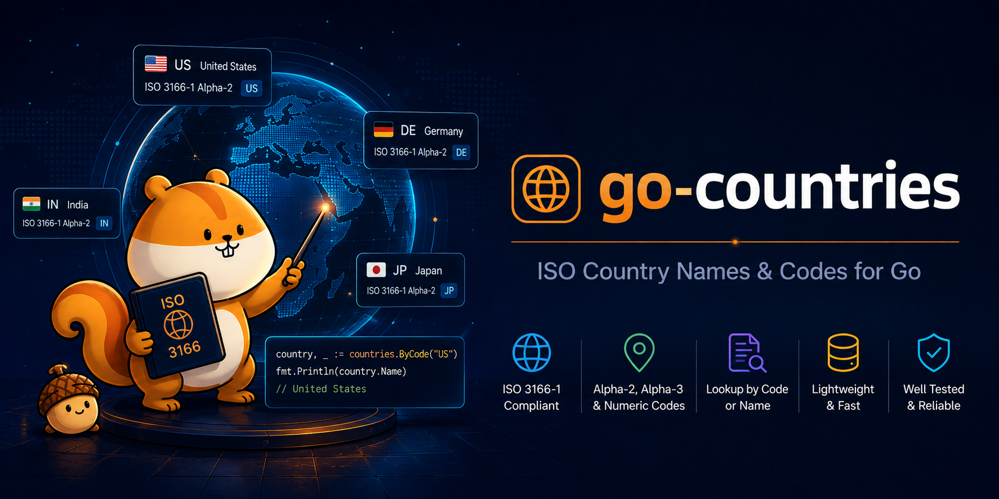

<p align="center">
  
</p>

# go-countries

**The ISO 3166-1 country list and the groupings that decide where data is allowed to live.**

[](https://pkg.go.dev/github.com/PlakarKorp/go-countries)
[](https://goreportcard.com/report/github.com/PlakarKorp/go-countries)
[](https://codecov.io/gh/PlakarKorp/go-countries)
[](https://github.com/PlakarKorp/go-countries/actions/workflows/go.yml)
[](LICENSE)

`go-countries` is a Go library, not a command-line tool. It answers the
questions that come up once a region string has been resolved to a country
code and something has to be done about it: is this a real country, what
continent is it on, and is it inside the EU or the EEA.

It is a data package with no dependencies and no runtime cost beyond a map
read. If you are looking for subdivisions, currencies or calling codes, this is
not that library.

## Overview

The ISO 3166-1 list is embedded in the binary as a generated table, so there is
no data file to ship, no network call, and no initialisation to sequence.
Lookups are map reads against indexes built once at init.

Codes are the currency of the API. A country is identified by its alpha-2 code
(`FR`), and every lookup accepts the alpha-2, alpha-3 or numeric spelling so
callers do not have to normalise before asking.

## Use-cases

Data residency is the case this was written for. A backup or replication policy
is expressed in terms of where data may come to rest, which means turning a
provider region (`eu-west-3`, `francecentral`, `nl-ams-1`) into a country, then
asking whether that country satisfies the policy. The mapping from region to
country belongs to the provider; deciding what the answer means belongs here.

The same table serves anything that has to validate a country code, group
countries by continent, or distinguish EU from EEA from neither — regulatory
reporting, address validation, tax and VAT rules, per-region feature gating.

## Features

- The full ISO 3166-1 list, 249 entries, embedded in the binary.
- Lookup by alpha-2, alpha-3 or numeric code, in any case (`FR`, `fra`, `250`).
- UN M49 region and sub-region for every classified country.
- EU (27) and EEA (30) membership, kept correct by tests rather than by hand.
- ISO short names alongside the common ones (`United Kingdom`, not
  `United Kingdom of Great Britain and Northern Ireland`).
- No dependencies, no data files, no network access, no `init` ordering to
  worry about.

## Installation

```sh
go get github.com/PlakarKorp/go-countries
```

## Usage

Here's a basic example of how to use the package:

```go
package main

import (
	"fmt"

	countries "github.com/PlakarKorp/go-countries"
)

func main() {
	c, ok := countries.Get("fr")
	if !ok {
		return
	}

	fmt.Println(c.CommonName()) // France
	fmt.Println(c.Alpha3)       // FRA
	fmt.Println(c.Numeric)      // 250
	fmt.Println(c.Region)       // Europe
	fmt.Println(c.SubRegion)    // Western Europe
	fmt.Println(c.EU, c.EEA)    // true true

	fmt.Println(countries.IsEU("GB"))  // false
	fmt.Println(countries.IsEEA("CH")) // false, EFTA but not EEA

	fmt.Println(len(countries.All()))                            // 249
	fmt.Println(len(countries.EUMembers()))                      // 27
	fmt.Println(len(countries.InRegion(countries.RegionEurope))) // 51
}
```

Validating a code without caring which country it is:

```go
if !countries.Valid(code) {
	return fmt.Errorf("%q is not an ISO 3166-1 country", code)
}
```

Gating on residency, which is the shape the library exists for:

```go
// A policy that says "EU only" is not the same as "Europe only": Cyprus is a
// member state that UN M49 files under Western Asia.
func allowed(code string) bool {
	return countries.IsEU(code)
}
```

## API

| Function | Returns |
|----------|---------|
| `Get(code)` | The `Country` for an alpha-2, alpha-3 or numeric code, and whether it is known |
| `Valid(code)` | Whether the code names an ISO 3166-1 country |
| `All()` | Every country, ordered by alpha-2 code |
| `InRegion(region)` | The countries of a UN M49 region |
| `InSubRegion(sub)` | The countries of a UN M49 sub-region, matched case-insensitively |
| `EUMembers()` / `EEAMembers()` | The member states, ordered by alpha-2 code |
| `IsEU(code)` / `IsEEA(code)` | Whether the code names a member state |

A `Country` carries `Name`, `Alpha2`, `Alpha3`, `Numeric`, `Region`,
`SubRegion`, `EU` and `EEA`, with `CommonName()` for the everyday spelling and
`String()` returning the alpha-2 code.

## Notes

`Get` reports `ok=false` for a code it does not know rather than substituting a
default, because what to do about an unknown country is the caller's decision.

The UN M49 classification does not cover every ISO country: Antarctica (`AQ`)
and Taiwan (`TW`) have no region, so their `Region` and `SubRegion` are empty.
That is unknown, not a bug, and a test names those two so that a change
upstream is noticed rather than absorbed.

`Name` is the ISO short name, which for some countries is the formal spelling.
`CommonName()` gives the one people write.

EU and EEA membership are political facts rather than ISO ones, so the source
data does not carry them and they are maintained in the generator. The tests
assert their cardinality and that every EU member is also in the EEA, so a bad
edit fails the build. Switzerland is the case worth knowing: EFTA, but not EEA.

## Regenerating the data

`countries_data.go` is generated from the ISO 3166-1 list published with UN M49
region codes. Regenerating needs no toolchain beyond Go itself:

```sh
go generate ./...
```

See [internal/gen](internal/gen/README.md) for the details, including how to
regenerate from a local copy of the CSV when reviewing a data change.

## Testing

```sh
go test ./...
```

CI runs the same tests with `-race`, uploads the coverage profile and the test
results to [Codecov](https://codecov.io/gh/PlakarKorp/go-countries), and
regenerates the table from upstream to diff it against the committed file.
`internal/gen` is excluded from the coverage report: it is a build tool rather
than shipped code, and the reproducibility check is what actually guards it.

The tests spend most of their effort on the integrity of the generated table
rather than on the lookup wrappers: that the codes are well-formed and unique,
that the table is sorted, that the regions partition it, that sub-regions nest
under one region each, and that the membership sets are the right size. That is
what catches a bad regeneration, which is the failure a generated table most
invites.

## Contributing

We welcome contributions!
If you have a feature request, bug report, or wish to contribute code, please open an issue or pull request.

## Community

Join our active [Discord](https://discord.gg/A2yvjS6r2C) to discuss the project.

## License

`go-countries` is released under the ISC License. See [LICENSE](LICENSE).
